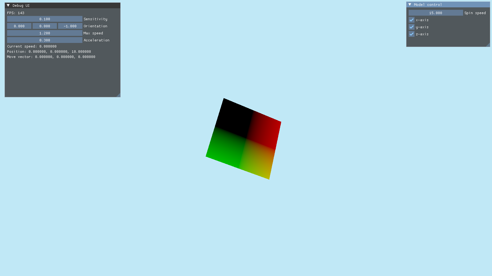

> [!WARNING]
> This is very early in development and probably impractical to use in its current state.

# Muon Engine
Muon is an experimental game engine built for curiosity and learning graphics programming.

## Features
- Bindless textures
- Dynamic rendering
- In-progress render graph

## Usage
> [!IMPORTANT]
> Project uses CMake 4.0.0, C++23, and targets Vulkan 1.3.

Add as a git submodule and link to the required libraries.

## Project Conventions
| item | convention |
| ---- | ---- |
| integers | use `cstdint`/`stdint.h` integer types: `int32_t`, `int64_t`, etc. |
| classes, structs | named in PascalCase: `FileManager`, `MaterialInfo` |
| functions, methods | named in PascalCase: `RenderModel()` |
| variables, lambdas | named in camelCase: `fileIndex` |
| static variables | name begins with `s_`, e.g.: `static tracy::VkCtx *s_tracyContext;` |
| member variables | name begins with `m_`, e.g.: `Device &m_device;` |
| pointers, references | `*` and `&` must be on the variable name, e.g.: `const std::vector<uint8_t> &data;` |
| files | open compound named in snake_case: `frame_handler.hpp` |
| class/struct visibility | group visibility by methods and members separately |
| headers | always use `.hpp` extension over `.h` to be C++ specific |
| abbreviations, initialisations | treated as single words: `Hdr`, `Ssao`, `Gltf` |
| code spelling | follow American English |
| non-code spelling | may follow preferred English dialect |
| commits | commits should follow the [Conventional Commits Spec](https://www.conventionalcommits.org/en/v1.0.0/), post 2025-05-24 |

## Attributions
- SPIRV-Reflect
- glslang
- SPIRV-Tools
- GLFW
- Vulkan
- Vulkan Memory Allocator
- Vulkan Memory Allocator Hpp
- GLM
- Tracy
- spdlog
- ImGui
- eventpp
- Lua
- sol2
- yaml-cpp
- libspng
- libjpeg-turbo
